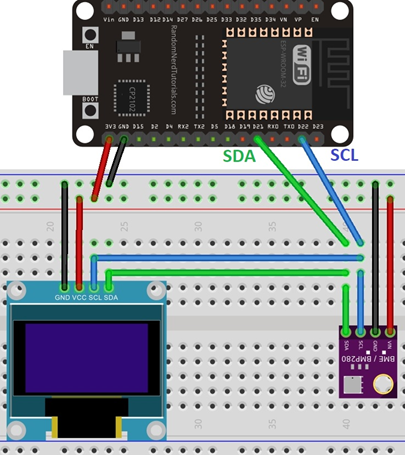
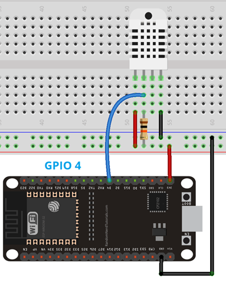

# ESP32 WiFi Weather Station with LCD

## Description

The following application enables ESP32 to work as a WiFi weather station, providing information about air pressure, temperature and humidity.
The whole project consists of:
- ESP32 application
- React web application with graph visualizations of live data aquired from ESP32 using prapared API.

The following repository contains only ESP32 application.

## Parts & schematic

### Needed parts

* ESP32 (ESP-WROOM-32D)
* SSD1306 (128x32) LCD screen
* BME280 sensor – air pressure, temperature and humidity sensor
* DHT22 sensor – air temperature and humidity (possible use instead of better BME280 sensor; schematic modifications required)

### Schematic A - variant with BME280 sensor

### Schematic B - variant with DHT22 sensor (modified Schamatic A)

## Component applications and development

### Component applications:
* ESP32 app (C++ ESP32 app)
    - https://github.com/damianboguszpl/ESP32_SSD1306_BME280_DHT22
* React web app (TypeScript, React, Node.js, Chart.js)
    - https://github.com/kardahim/weather_esp_frontend/

### Created as a small college project through the collaboration of:
* https://github.com/damianboguszpl
* https://github.com/kardahim

### Division of work

#### damianboguszpl
* Creating ESP32 application
* Preparing diagrams and schematics

#### kardahim
* Creating web application
